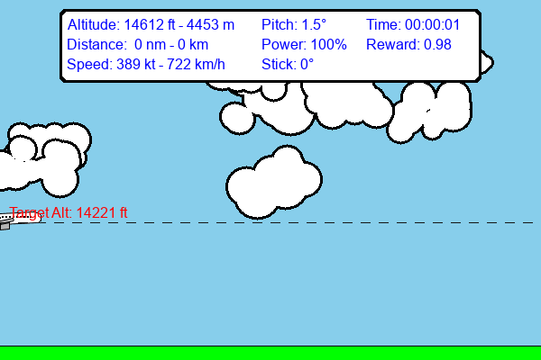
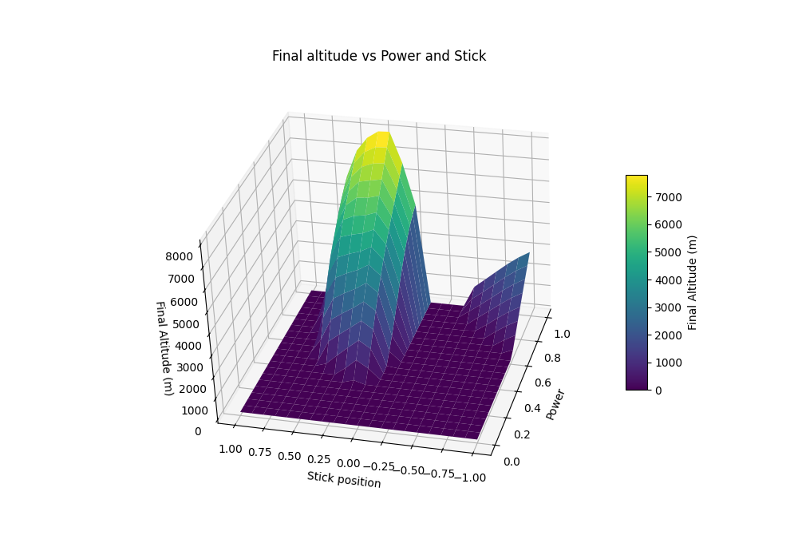

# ✈️ Plane: Reinforcement Learning Environment for Aircraft Control



**Plane** is a lightweight yet realistic **reinforcement learning environment** simulating a 2D side view of an Airbus A320-like aircraft.  
It’s designed for **fast, end-to-end training on GPU with JAX** while staying **physics-based** and **realistic enough** to capture the core challenges of aircraft control.  

Plane allows you to benchmark RL agents on **delays, perturbations, irrecoverable states, partial observability, and competing objectives** — challenges that are often ignored in standard toy environments.

---

## ✨ Features

- 🏎 **Fast & parallelizable** thanks to JAX — scale to thousands of parallel environments on GPU/TPU.  
- 📐 **Physics-based**: Dynamics are derived from airplane modeling equations (not arcade physics).  
- 🧪 **Reliable**: Covered by unit tests to ensure stability and reproducibility.  
- 🎯 **Challenging**: Captures real-world aviation control problems (momentum, delays, irrecoverable states).  
- 🔄 **Compatible with both worlds**:  
  - [Gymnasium](https://gymnasium.farama.org/) (with Stable-Baselines3)  
  - [Gymnax](https://github.com/RobertTLange/gymnax) (with sbx / JAX-native RL libraries)  

---

## 📊 Stable Altitude vs. Power & Pitch

Below is an example of how stable altitude changes with engine power and pitch:  



This highlights the **multi-stability** phenomenon: holding a constant power setting can lead the plane to naturally converge to a stable altitude.

---

## 🚀 Installation

Once released on PyPI, you can install Plane with:

```bash
# Using pip
pip install plane-env

# Or with Poetry
poetry add plane-env
```

---

## 🎮 Usage

Plane supports **both Gymnasium and Gymnax interfaces**.  
Here are some examples to get you started:

### Gymnasium (with Stable-Baselines3)

```python
import gymnasium as gym
import plane_env

# Create environment
env = gym.make("Plane-v0", render_mode="rgb_array")

# Rollout a random policy and save a video
from stable_baselines3.common.vec_env import VecVideoRecorder, DummyVecEnv

vec_env = DummyVecEnv([lambda: env])
video_env = VecVideoRecorder(vec_env, "videos/", record_video_trigger=lambda x: x == 0, video_length=200)
obs = video_env.reset()

for _ in range(200):
    action = video_env.action_space.sample()
    obs, reward, done, info = video_env.step(action)
    if done:
        video_env.reset()

video_env.close()
```

### Gymnax (with sbx)

```python
import jax
import jax.numpy as jnp
import gymnax
import plane_env

# Create environment
env, params = plane_env.make("PlaneJax-v0")

# Vectorize & run multiple parallel environments
key = jax.random.PRNGKey(0)
reset_fn = jax.vmap(env.reset, in_axes=(0, None))
step_fn = jax.vmap(env.step, in_axes=(0, 0, None, None))

keys = jax.random.split(key, 16)
obs, state = reset_fn(keys, params)

def rollout_step(carry, _):
    obs, state, key = carry
    action = jax.random.randint(key, (), 0, env.action_space().n)
    key, subkey = jax.random.split(key)
    obs, state, reward, done, info = step_fn(obs, state, action, subkey, params)
    return (obs, state, key), (obs, reward, done)

(_, _, _), (obs_hist, reward_hist, done_hist) = jax.lax.scan(rollout_step, (obs, state, key), None, length=200)
```

---

## 🧩 Challenges Modeled

Plane is designed to test RL agents under **realistic aviation challenges**:

- ⏳ **Delay**: Engine power changes take time to fully apply.  
- 🌪 **Perturbations**: Random wind gusts alter dynamics.  
- 👀 **Partial observability**: Some forces and wind speeds cannot be directly measured.  
- 🏁 **Competing objectives**: Reach target altitude fast while minimizing fuel and overshoot.  
- 🌀 **Momentum effects**: Control inputs show delayed impact due to physical inertia.  
- ⚠️ **Irrecoverable states**: Certain trajectories inevitably lead to failure (crash).  

---

## 📦 Roadmap

- [ ] Add pitch as a controllable action.  
- [ ] Expand challenges (sensor noise, turbulence models).  
- [ ] Provide ready-to-use benchmark results for popular RL baselines.  

---

## 🤝 Contributing

Contributions are welcome!  
Please open an issue or PR if you have suggestions, bug reports, or new features.  

---

## 📜 License

MIT License – feel free to use it in your own research and projects.  
