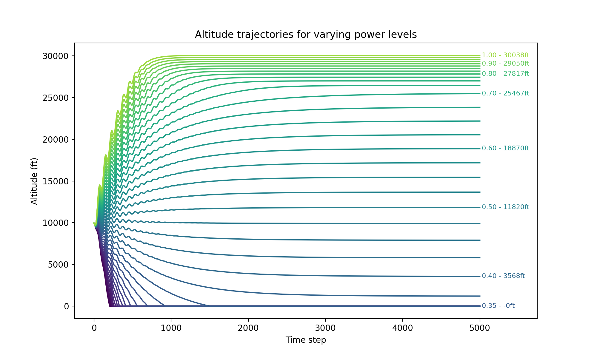
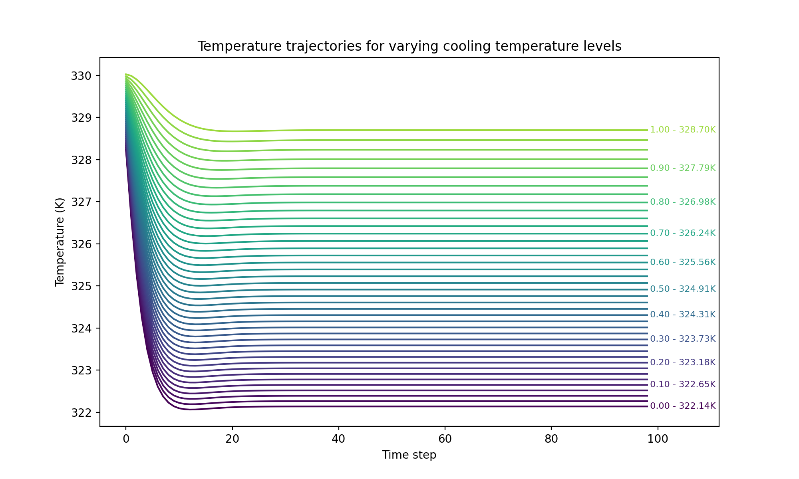
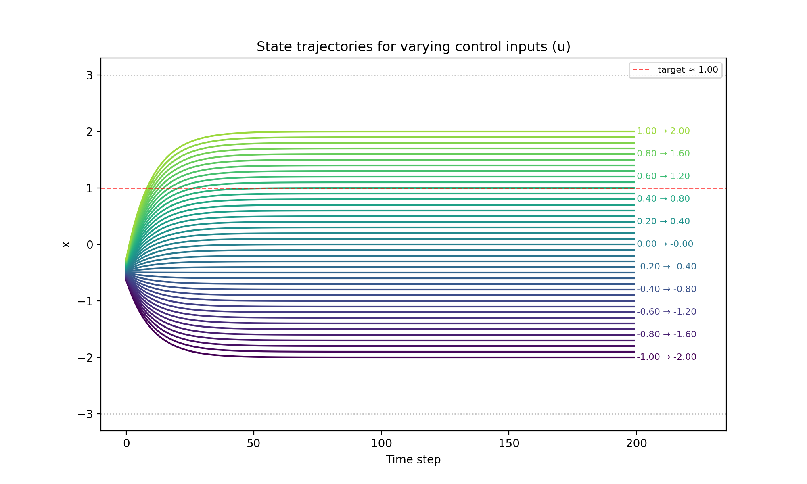
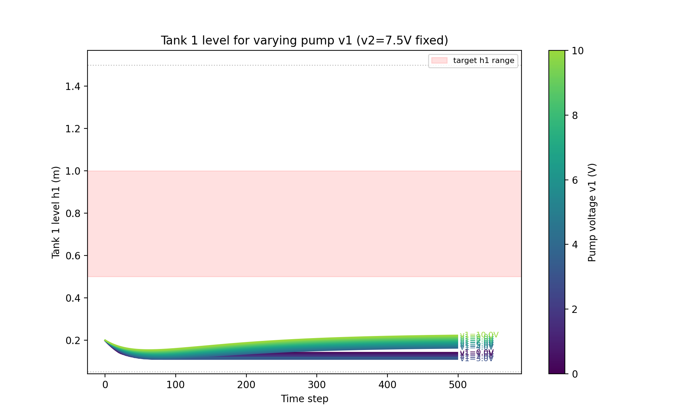
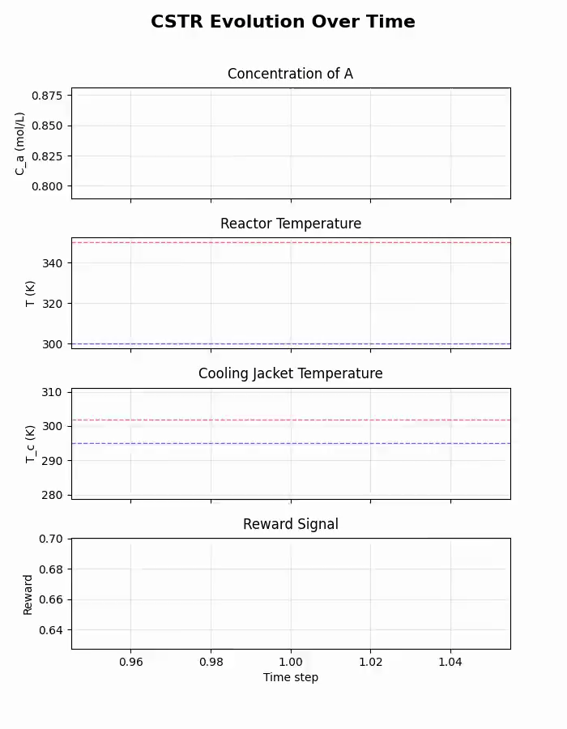
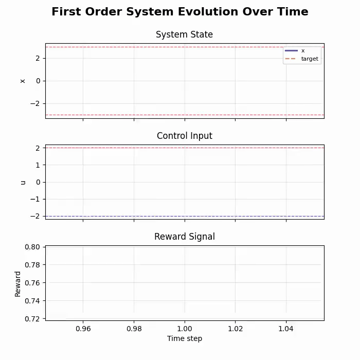
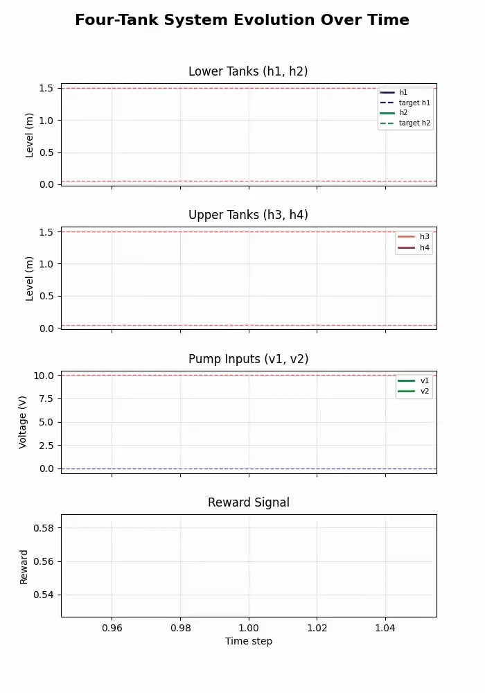

# TargetGym: Reinforcement Learning Environments for Target MDPs


**TargetGym** is a lightweight yet realistic collection of **reinforcement learning environments** designed around **target MDPs** -- tasks where the objective is to **reach and maintain a specific subset of states** (target states).

Environments are built to be **fast, parallelizable, and physics-based**, enabling large-scale RL research while capturing the core challenges of real-world control systems such as **delays, irrecoverable states, partial observability, and competing objectives**.

---

## Environments

### Physical Control

| Environment | Goal | Action Dim | Obs Dim | Steps/s (CPU, 10^8 steps) |
|---|---|---|---|---|
| Plane 2D | Reach and hold a target altitude with an A320-like aircraft | 2 (power, stick) | 9 | ~0.54M |
| Plane 3D -- Heading | Reach and hold a target altitude and heading | 3 (power, stick, aileron) | 15 | -- |
| Plane 3D -- Circle | Maintain altitude while orbiting a circular path | 3 (power, stick, aileron) | 17 | -- |
| Plane 3D -- Figure Eight | Follow a 3D twisted lemniscate (figure-8 with altitude crossovers) | 3 (power, stick, aileron) | 19 | -- |

### Process Control (adapted from [PC-gym](https://github.com/MaximilianB2/pc-gym))

| Environment | Goal | Action Dim | Obs Dim | Steps/s (CPU, 10^8 steps) |
|---|---|---|---|---|
| CSTR | Control coolant temperature to keep reactant concentration at a target | 1 (coolant temp) | 3 | ~1.49M |
| First Order System | Drive a first-order lag system to a target setpoint | 1 (input) | 2 | -- |
| Four Tank | Control water levels in two lower tanks via two pumps in a coupled four-tank network | 2 (pump voltages) | 6 | -- |

### Industrial / Energy

| Environment | Goal | Action Dim | Obs Dim | Steps/s (CPU, 10^8 steps) |
|---|---|---|---|---|
| Glass Furnace | Track a crown temperature schedule in a 3-zone glass melting furnace | 1 (fuel flow) | 3 | -- |
| Nuclear Reactor | Control neutron power via rod reactivity in a PWR with xenon dynamics | 1 (rod reactivity) | 4 | -- |

---

## Complexity Classification

Environments are designed to span a wide range of difficulty, making TargetGym suitable both as an RL benchmark suite and as a curriculum. Complexity is assessed from two angles: **dynamics** (linearity, coupling, stiffness) and **RL difficulty** (state/action dimensionality, horizon length, reward shaping, partial observability).

| Tier | Environment | Obs Dim | Action Dim | Dynamics | Key RL Challenges |
|---|---|---|---|---|---|
| 1 -- Trivial | First Order System | 2 | 1 | Linear SISO | Baseline sanity-check |
| 2 -- Medium | CSTR | 3 | 1 | Nonlinear SISO | Exponential Arrhenius kinetics, stiff dynamics, exothermic runaway risk |
| 3 -- Hard | Four Tank | 6 | 2 | Nonlinear MIMO | Multi-objective, cross-coupled inputs, square-root outflow |
| 4 -- Very Hard | Plane 2D | 9 | 2 | 2D aerodynamics | Coupled nonlinear aerodynamics, very long horizon (10 000 steps) |
| 4 -- Very Hard | Glass Furnace | 3 | 1 | Nonlinear radiation (T^4) | **Partial observability** (5/8 states hidden), multi-hour transients, schedule tracking |
| 4 -- Very Hard | Nuclear Reactor | 4 | 1 | Stiff multi-timescale | **Partial observability** (7/11 states hidden), xenon memory trap, 86k-step horizon |
| 5 -- Extreme | Plane 3D -- Heading | 15 | 3 | 3D aerodynamics | Multi-objective (altitude + heading), roll/pitch/yaw coupling |
| 5 -- Extreme | Plane 3D -- Circle | 17 | 3 | 3D + path following | Sustained coordinated banked turns, km-scale circular path |
| 6 -- Extreme+ | Plane 3D -- Figure Eight | 19 | 3 | 3D + twisted lemniscate | 3D path with altitude crossovers, direction reversal, MPC >> PID gap |

---

## Figures

<table align="center">
  <tr>
    <td align="center">
      <br/>
      <b>Plane</b> -- altitude under constant power/stick inputs
    </td>
    <td align="center">
      <br/>
      <b>CSTR</b> -- reactor temperature under constant coolant temperatures
    </td>
  </tr>
  <tr>
    <td align="center">
      <br/>
      <b>First Order System</b> -- state trajectories under constant inputs
    </td>
    <td align="center">
      <br/>
      <b>Four Tank</b> -- tank 1 level under varying pump voltages
    </td>
  </tr>
</table>

---

## Videos

<table align="center">
  <tr>
    <td align="center">
      <br/>
      Plane 2D (PID)
    </td>
    <td align="center">
      <br/>
      CSTR (PID)
    </td>
  </tr>
  <tr>
    <td align="center">
      <br/>
      First Order System (PID)
    </td>
    <td align="center">
      <br/>
      Four Tank (PID)
    </td>
  </tr>
  <tr>
    <td align="center">
      <br/>
      Nuclear Reactor (PID)
    </td>
  </tr>
</table>

---

## Expert Baselines

Every environment ships with two expert baselines for comparison and for bootstrapping RL exploration:

- **PID**: Relay-autotuned or gradient-tuned PID controllers. Gain-scheduled variants adapt to different operating points. For 3D plane tasks, specialized multi-loop PIDs handle altitude + heading/circle/figure-8 tracking.
- **MPC**: Model Predictive Control via CasADi/IPOPT (process control envs) or gradient-based MPC through JAX autodiff (plane, car). Provides near-optimal performance but is too slow for real-time use.

The PID controllers, while suboptimal, provide useful expert demonstrations for **expert-guided RL** methods (behavior cloning warm-start, demo-augmented replay, DAgger). The performance gap between PID and MPC (especially on Plane 3D Figure-8: PID ~15 vs MPC ~560) demonstrates that these tasks genuinely require learned multi-axis coordination.

---

## Features

* **Fast & parallelizable** with JAX -- scale to thousands of parallel environments on GPU/TPU.
* **Physics-based**: Derived from modeling equations, not arcade physics.
* **Reliable**: Unit-tested for stability and reproducibility.
* **Target MDP focus**: Each task is about reaching and maintaining target states.
* **Expert baselines**: PID and MPC controllers for every environment.
* **Challenging dynamics**: Captures irrecoverable states, partial observability, and momentum effects.
* **Visualization**: All environments come with rendering and video generation.
* **Compatible with RL libraries**: Offers [Gymnax](https://github.com/RobertTLange/gymnax) and [Gymnasium](https://github.com/Farama-Foundation/Gymnasium) interfaces.

---

## Installation

Once released on PyPI, install with:

```bash
# Using pip
pip install target-gym

# Or with Poetry
poetry add target-gym
```

---

## Usage

Here's a minimal example of running an episode in the **Plane** environment and saving a video:

```python
from target_gym import Plane, PlaneParams

# Create env
env = Plane()
seed = 42
env_params = PlaneParams(max_steps_in_episode=1_000)

# Simple constant policy with 80% power and 0 deg stick input
action = (0.8, 0.0)

# Save the video
env.save_video(lambda o: action, seed, folder="videos", episode_index=0, params=env_params, format="gif")
```

Or train an agent using your favorite RL library (example with stable-baselines3):

```python
from target_gym import GymnasiumPlane
from stable_baselines3 import SAC

env = GymnasiumPlane()
model = SAC("MlpPolicy", env, verbose=1)
model.learn(total_timesteps=10_000, log_interval=4)
model.save("sac_plane")

obs, info = env.reset()
while True:
    action, _states = model.predict(obs, deterministic=True)
    obs, reward, terminated, truncated, info = env.step(action)
    if terminated or truncated:
        break
```

---

## Challenges Modeled

TargetGym tasks are designed to expose RL agents to **realistic control challenges**:

* [x] **Delays**: Inputs (like engine power) take time to fully apply.
* [x] **Partial observability**: Some parts of the state cannot be directly measured (glass furnace, reactor).
* [x] **Competing objectives**: Reach the target state quickly while minimizing overshoot or cost.
* [x] **Momentum effects**: Physical inertia delays control effectiveness.
* [x] **Irrecoverable states**: Certain trajectories inevitably lead to failure (crash, runaway).
* [x] **Multi-timescale dynamics**: From millisecond neutronics to hour-long xenon transients (reactor).
* [ ] **Non-stationarity**: Introduce perturbations in the environments.

---

## Roadmap

* [ ] Add perturbations (wind, turbulence) for non-stationary dynamics.
* [ ] Provide benchmark results for popular RL baselines.
* [ ] Mature glass furnace and reactor environments (shorter episodes, better reward shaping).
* [ ] Add random orientation variations to circle and heading tasks.

---

## Contributing

Contributions are welcome!
Open an issue or PR if you have suggestions, bug reports, or new features.

For development you need to install the dev dependencies, which include test, lint and agent dependencies.

```bash
git clone https://github.com/YannBerthelot/TargetGym.git
cd TargetGym

# Using Poetry (recommended)
poetry install --with dev

# Using pip
python -m pip install -e ".[dev]"

```

---


## Citation

If you use **TargetGym** in your research or project, please cite it as:

```bibtex
@misc{targetgym2025,
  title        = {TargetGym: Reinforcement Learning Environments for Target MDPs},
  author       = {Yann Berthelot},
  year         = {2025},
  url          = {https://github.com/YannBerthelot/TargetGym},
  note         = {Lightweight physics-based RL environments for aircraft, process control, and industrial systems}
}
```


---

## License

MIT License -- free to use in research and projects.
