# TargetGym: Reinforcement Learning Environments for Target MDPs


**TargetGym** is a collection of JAX **reinforcement learning environments** built
around **target MDPs** -- tasks where the objective is to **reach and maintain a
subset of states**, not to reach a goal and stop. Holding a setpoint against
disturbances, forever, is what industrial control actually is.

Eighteen environments spanning aircraft, process, industrial and energy plants.
They are fast (0.3-17 M steps/s on CPU, `jit`/`vmap`/`scan` throughout) and
their physics is a **documented, tested contract** rather than a claim: every
environment carries a `PHYSICS.md` with a sourced parameter table, published
validation targets asserted by tests, and quantified known deviations.

What they are *for* is the failure modes that make real control hard:

| | |
|---|---|
| **Irrecoverable states** | A boiler drum that carries water into the turbine, a reactor past runaway, a kiln that has gone cold |
| **Partial observability** | The furnace hides 6 of 9 states, the reactor 7 of 11, the kiln 64 behind 8 measurements |
| **Non-minimum phase** | Drum level rises as mass *leaves*; the four-tank's obvious loop pairing is unstable |
| **Transport delay** | Half the kiln's response to a fuel change takes a full 25-minute residence time |
| **Multi-timescale** | Millisecond neutronics against hour-long xenon; sub-second flame gas against 30 h glass residence |
| **Finite budgets** | A battery whose tracking *now* costs the ability to track later |

Every environment ships a PID baseline and sixteen of eighteen also ship an
MPC, so a learned policy has something real to beat -- and where a baseline is
weak, the docs say how weak.

---

## Environments

Throughput is measured with `python -m target_gym.benchmark_speed`: 256 environments
under `vmap`, stepped 800 deep inside one `jit`-compiled `scan`, on CPU -- the way an
RL loop actually drives them. Figures scale with batch size and are much higher on GPU.


### Aircraft

| Environment | Goal | Action Dim | Obs Dim | Steps/s (CPU, vmap 256) |
|---|---|---|---|---|
| Plane 2D | Reach and hold a target altitude with an A320-like aircraft | 2 (power, stick) | 9 | ~5.4M |
| Plane 3D -- Heading | Reach and hold a target altitude and heading | 3 (power, stick, aileron) | 15 | ~2.8M |
| Plane 3D -- Circle | Maintain altitude while orbiting a circular path | 3 (power, stick, aileron) | 17 | ~2.6M |
| Plane 3D -- Figure Eight | Follow a 3D twisted lemniscate (figure-8 with altitude crossovers) | 3 (power, stick, aileron) | 19 | ~2.7M |

### Multi-Agent / Formation

Close-patrol tasks where the target is a **moving slot** defined relative to a
lead aircraft — a dynamic target MDP with collision as a new irrecoverable
state. Both single-agent (scripted lead) and cooperative multi-agent (both
aircraft learn) variants share the same 3D physics.

| Environment | Goal | Action Dim | Obs Dim | Steps/s (CPU, vmap 256) |
|---|---|---|---|---|
| Plane Patrol | Hold a slot behind a scripted (maneuvering) lead | 3 (power, stick, aileron) | 26 | ~2.2M |
| Plane Patrol -- Bearing-only | Same, but the follower sees only range + bearing to the lead (partial obs) | 3 | 21 | ~2.2M |
| Plane Patrol -- MARL / Formation | `1 + num_wingmen` learners (up to 5 planes): lead flies its patrol pattern, wingmen hold slots **evenly spread across both sides** (cooperative team reward, JaxMARL-style API) | 3 per agent | 18 (lead) / 26 (wingman) | see note |

### Process
*The first three are adapted from [PC-gym](https://github.com/MaximilianB2/pc-gym); their models were verified against its source term for term.*

| Environment | Goal | Action Dim | Obs Dim | Steps/s (CPU, vmap 256) |
|---|---|---|---|---|
| CSTR | Control coolant temperature to keep reactant concentration at a target | 1 (coolant temp) | 3 | ~111M |
| First Order System | Drive a first-order lag system to a target setpoint | 1 (input) | 2 | ~1670M |
| Four Tank | Control water levels in two lower tanks via two pumps in a coupled four-tank network | 2 (pump voltages) | 6 | ~101M |
| pH Neutralisation | Hold effluent pH at setpoint against an unmeasured, drifting carbonate buffer | 1 (base flow) | 3 | ~2.1M |
| Binary Distillation | Hold both product purities in a 32-tray column with strongly coupled inputs | 2 (reflux, boil-up) | 6 | ~0.5M |

### Industrial

| Environment | Goal | Action Dim | Obs Dim | Steps/s (CPU, vmap 256) |
|---|---|---|---|---|
| Glass Furnace | Hold a crown temperature setpoint in a regenerative float-glass furnace | 1 (fuel flow) | 5 | ~3.0M |
| Nuclear Reactor | Control neutron power via rod reactivity in a PWR with xenon dynamics | 1 (rod reactivity) | 4 | ~1.3M |
| Building HVAC | Track a scheduled comfort setpoint against weather and occupancy | 1 (heating power) | 7 | ~17.1M |
| Boiler Drum | Hold drum level and pressure in a natural-circulation boiler through shrink and swell | 2 (firing, feedwater) | 7 | ~10.0M |
| Cement Kiln | Hold clinker free lime on target across a half-hour transport delay | 2 (fuel, kiln speed) | 8 | ~0.7M |

### Energy

| Environment | Goal | Action Dim | Obs Dim | Steps/s (CPU, vmap 256) |
|---|---|---|---|---|
| Wind Turbine | Hold rated power through gusts and turbulence on a NREL 5 MW reference machine | 2 (torque, pitch) | 6 | ~17.8M |
| Grid Battery | Follow a grid dispatch signal from a finite, degrading energy store | 1 (power) | 5 | ~7.5M |

---

## Complexity Classification

Environments are designed to span a wide range of difficulty, making TargetGym suitable both as an RL benchmark suite and as a curriculum. Complexity is assessed from two angles: **dynamics** (linearity, coupling, stiffness) and **RL difficulty** (state/action dimensionality, horizon length, reward shaping, partial observability).

| Tier | Environment | Obs Dim | Action Dim | Dynamics | Key RL Challenges |
|---|---|---|---|---|---|
| 1 -- Trivial | First Order System | 2 | 1 | Linear SISO | Baseline sanity-check |
| 2 -- Medium | CSTR | 3 | 1 | Nonlinear SISO | Exponential Arrhenius kinetics, stiff dynamics, exothermic runaway risk |
| 3 -- Hard | Building HVAC | 7 | 1 | Linear RC network | **Partial observability** (thermal mass hidden), 43 h time constant, setback anticipation, comfort/energy trade-off |
| 3 -- Hard | Four Tank | 6 | 2 | Nonlinear MIMO | **Non-minimum phase** (gamma1+gamma2 = 0.4): the RGA element is *negative*, so the obvious diagonal pairing is unstable and the loops must be crossed. Square-root outflow, cross-coupled pumps |
| 3 -- Hard | Grid Battery | 5 | 1 | Nonlinear ECM | **Finite budget**: tracking now costs the ability to track later; irrecoverable charge limits, state-dependent efficiency |
| 4 -- Very Hard | Wind Turbine | 6 | 2 | Nonlinear aero-elastic | Turbulent unmeasured inflow, region switching, drive-train torsion, thrust/power trade-off |
| 4 -- Very Hard | pH Neutralisation | 3 | 1 | Implicit algebraic | 45x steady-state gain variation across the range, unmeasured buffering, same pH from different states |
| 4 -- Very Hard | Binary Distillation | 6 | 2 | Stiff nonlinear MIMO | **Ill-conditioned** (condition number ~140): the two purities move together far more easily than apart |
| 5 -- Extreme | Boiler Drum | 7 | 2 | Nonlinear, two-phase | **Non-minimum phase**: the level's first move is the wrong way. Integrating output (no self-regulation), irrecoverable trips both sides, hidden riser voidage |
| 6 -- Extreme+ | Cement Kiln | 8 | 2 | Distributed (1D advection + Arrhenius) | **Transport delay**: half the response to a fuel change takes a full 25-min residence time. 64 hidden states behind 8 measurements, one input that moves the delay itself, irrecoverable both hot and cold |
| 4 -- Very Hard | Plane 2D | 9 | 2 | 2D aerodynamics | Coupled nonlinear aerodynamics, very long horizon (10 000 steps) |
| 4 -- Very Hard | Glass Furnace | 5 | 1 | Nonlinear radiation (T^4) | **Partial observability** (6/9 states hidden), regenerator reversal cycle, multi-hour transients, batch-blanket nonlinearity |
| 4 -- Very Hard | Nuclear Reactor | 4 | 1 | Stiff multi-timescale | **Partial observability** (7/11 states hidden), xenon memory trap, 86k-step horizon |
| 5 -- Extreme | Plane 3D -- Heading | 15 | 3 | 3D aerodynamics | Multi-objective (altitude + heading), roll/pitch/yaw coupling |
| 5 -- Extreme | Plane 3D -- Circle | 17 | 3 | 3D + path following | Sustained coordinated banked turns, km-scale circular path |
| 6 -- Extreme+ | Plane 3D -- Figure Eight | 19 | 3 | 3D + twisted lemniscate | 3D path with altitude crossovers, direction reversal |
| 5 -- Extreme | Plane Patrol | 26 | 3 | 3D + moving target | **Non-stationary maneuvering reference**, relative-frame observation, collision (irrecoverable) |
| 6 -- Extreme+ | Plane Patrol -- MARL | 18 / 26 | 3 + 3 | 3D two-body | **Multi-agent coordination**, non-stationary co-player, shared collision state |

---

## Gallery

Every environment ships with rendering. Aircraft tasks render a physical
side + top-down scene; process/industrial tasks render the state, action and
reward evolution (with hidden states shown greyed out). All clips below are
expert (PID) rollouts.

### Aircraft

<table align="center">
  <tr>
    <td align="center">
      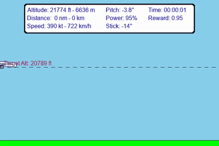<br/>
      <b>Plane 2D</b> -- reach & hold a target altitude
    </td>
    <td align="center">
      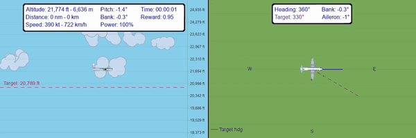<br/>
      <b>Plane 3D -- Heading</b> -- track altitude + heading
    </td>
  </tr>
  <tr>
    <td align="center">
      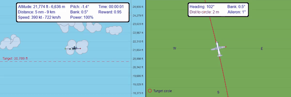<br/>
      <b>Plane 3D -- Circle</b> -- sustained banked orbit
    </td>
    <td align="center">
      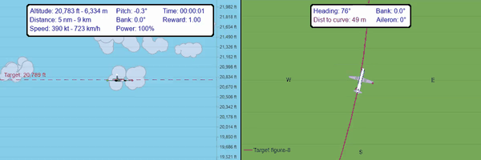<br/>
      <b>Plane 3D -- Figure-8</b> -- 3D twisted lemniscate
    </td>
  </tr>
  <tr>
    <td align="center">
      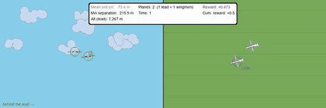<br/>
      <b>Plane Patrol</b> -- wingman (orange) flies parallel in a slot beside the lead (blue)
    </td>
    <td align="center">
      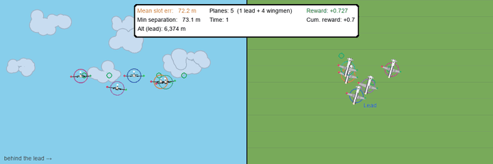<br/>
      <b>Plane Patrol -- Formation</b> -- a lead + 4 wingmen in a V, evenly spread across both sides
    </td>
  </tr>
</table>

### Process Control

<table align="center">
  <tr>
    <td align="center">
      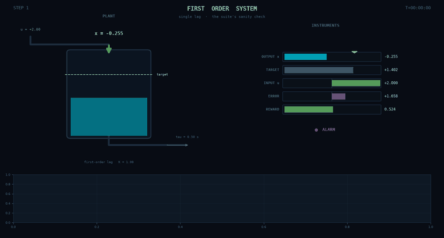<br/>
      <b>First Order System</b> -- the suite's sanity check
    </td>
    <td align="center">
      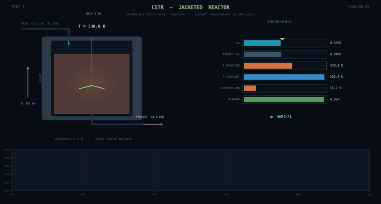<br/>
      <b>CSTR</b> -- exothermic, coolant-temperature input
    </td>
    <td align="center">
      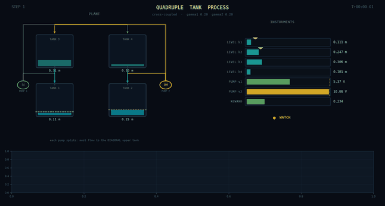<br/>
      <b>Four Tank</b> -- cross-coupled, negative RGA
    </td>
  </tr>
  <tr>
    <td align="center">
      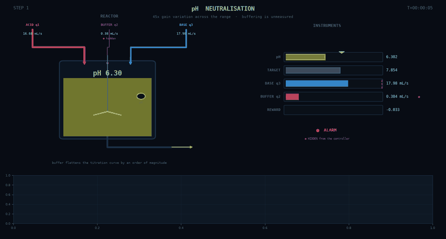<br/>
      <b>pH Neutralisation</b> -- 45x gain variation, unmeasured buffering
    </td>
    <td align="center">
      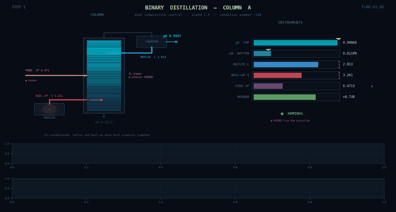<br/>
      <b>Binary Distillation</b> -- ill-conditioned, 41 hidden stages
    </td>
  </tr>
</table>

### Industrial

<table align="center">
  <tr>
    <td align="center">
      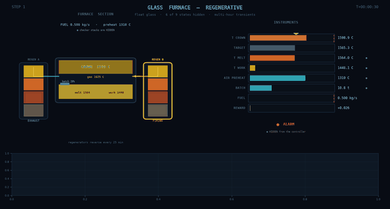<br/>
      <b>Glass Furnace</b> -- regenerator reversal, 6/9 states hidden
    </td>
    <td align="center">
      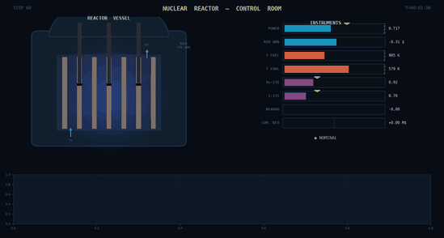<br/>
      <b>Nuclear Reactor</b> -- xenon memory, 30 pcm of rod margin
    </td>
    <td align="center">
      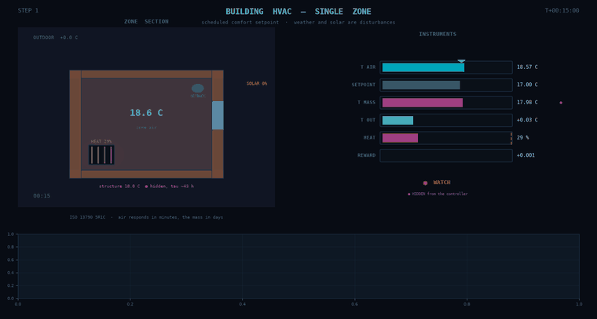<br/>
      <b>Building HVAC</b> -- hidden thermal mass, 43 h time constant
    </td>
  </tr>
  <tr>
    <td align="center">
      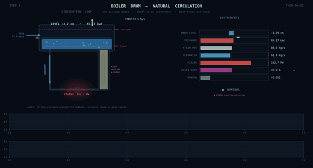<br/>
      <b>Boiler Drum</b> -- non-minimum phase: level rises as mass leaves
    </td>
    <td align="center">
      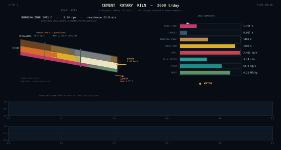<br/>
      <b>Cement Kiln</b> -- half-hour transport delay, 64 hidden states
    </td>
  </tr>
</table>

### Energy

<table align="center">
  <tr>
    <td align="center">
      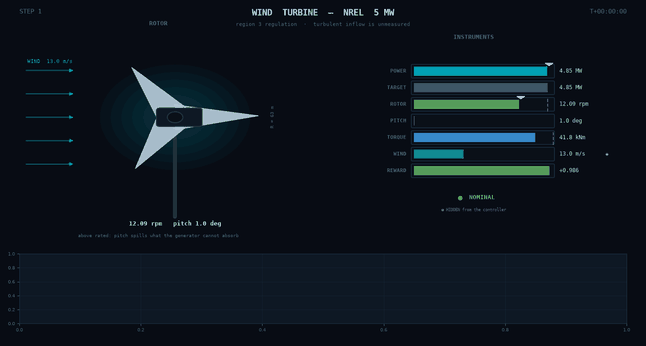<br/>
      <b>Wind Turbine</b> -- NREL 5 MW, turbulent unmeasured inflow
    </td>
    <td align="center">
      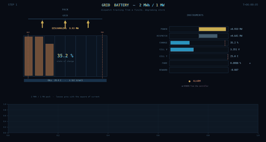<br/>
      <b>Grid Battery</b> -- finite budget: tracking now costs tracking later
    </td>
  </tr>
</table>

Every clip above is rendered by the shared control-room toolkit
(`target_gym/render_kit.py`): a live plant schematic, an instrument stack with
limit and setpoint markers, and strip charts. The schematics are drawn from
state the controller usually cannot see -- riser voidage, thermal mass, the
kiln's axial profile -- so a frame shows both what the agent measures and what
it is actually up against. A purple dot marks each hidden quantity.

---

## Expert Baselines

All eighteen environments ship a PID. Sixteen also ship an MPC; the two
**Plane Patrol** variants do not -- see *Baseline coverage* below.

- **PID**: Relay-autotuned or gradient-tuned controllers. Aircraft altitude tracking
  uses a **cascaded autopilot** (altitude -> vertical speed -> pitch -> elevator) with
  attitude limiting and angle-of-attack protection, since a single loop mapping
  altitude error straight to elevator departs controlled flight on large climbs.
- **MPC**: Three implementations, chosen per plant. **CasADi/IPOPT** where a
  symbolic NLP is natural; **gradient MPC** through JAX autodiff where the plant
  is already differentiable; and **cross-entropy sampling** for the cement kiln,
  which is gradient-free by necessity -- its free lime depends on temperature
  through a 280 kJ/mol Arrhenius term that is then advected down the kiln, so
  reverse-mode gradients overflow to NaN after about eight steps while finite
  differences on the same objective stay clean.

  An MPC objective must share the reward's *minimiser*, not its shape. Copying
  a clipped tracking reward gives the optimiser no gradient exactly where it is
  needed; dropping the clip makes large errors score better. Both failures
  happened here before the objectives became plain quadratics.

The right *structure* usually matters more than the gains, and the baselines are
chosen to show it: three-element control on the boiler drum, where feedwater
tracks measured steam flow as a feedforward so the level gauge cannot lie to it;
a cascade on the kiln, because integral action on a half-hour-old measurement
oscillates at the delay period; and **crossed** loops on the four-tank, whose
negative RGA element makes the obvious diagonal pairing unstable.

Every baseline is held to a **controller-effectiveness contract** in the test suite:
a PID must beat the best constant action on its environment. This is a deliberately
weak bar, but it is the bar a mis-wired controller fails -- it caught a furnace PID
that was tracking *fuel percentage* as its temperature setpoint after an observation
vector changed underneath it.

### Baseline coverage

| Environment | PID | MPC | Note |
|---|---|---|---|
| All process, industrial and non-patrol aircraft envs | yes | yes | passes the effectiveness contract |
| Plane Patrol | yes | no | Pursuit guidance toward the slot *position*. Holds formation on roughly half of evaluation seeds; see *Known gaps*. No MPC: the reference is a manoeuvring lead, so a CasADi formulation needs its future trajectory as a time-varying parameter. |
| Plane Patrol -- Bearing-only | yes | no | A lead-state estimator feeding the same pursuit law. Range with azimuth and elevation is a complete relative-position measurement, so only the lead's *heading* is genuinely unobservable; it is recovered from the lead's motion. Performance matches the full-observation expert, so the partial observation costs almost nothing here. |

---

## Physics Validation

Every environment's physics is a *documented, tested contract* rather than an
assertion. Each carries a `PHYSICS.md` beside its module giving:

* **Scope and regime of validity** -- what is modelled, what is deliberately
  omitted and why, and the operating envelope the model is calibrated for.
* **A sourced parameter table** -- every constant is cited, derived from
  geometry/first principles with the arithmetic shown, or explicitly flagged
  `TUNED - not sourced`.
* **Validation targets** -- published figures of merit the model must reproduce.
* **Known deviations** -- quantified, each carried by a `strict` xfail test so a
  fix flips it to passing and can never be resolved silently.

The method is written up in [`docs/PHYSICS_METHODOLOGY.md`](docs/PHYSICS_METHODOLOGY.md).
Its central rule: **never assert a formula by restating it**. A test that
recomputes its subject's own expression validates transcription, not
correctness, and fails in exactly the same way as a wrong formula. Tests assert
*emergent* consequences instead -- ISA table values, L/D ratios, thermal time
constants, energy-balance closure, equilibria, integrator convergence.

Worked examples of what this catches:

| Environment | Validated against | Example finding |
|---|---|---|
| Plane 2D | ISA atmosphere tables, A320 figures of merit | Lift-curve slope was 54 % below what its own aspect ratio implies, putting clean stall speed at 228 kt instead of ~150 kt |
| Glass Furnace | Published float-furnace data (4-6 GJ/tonne, 24-30 h residence) | Regenerators were absent entirely, so the energy balance was out by ~2x |
| Nuclear Reactor | Keepin 1965 delayed-neutron data, the inhour equation, published Xe-135 behaviour | The reactivity budget leaves only 30 pcm of rod margin at full power -- which is exactly what gives the xenon pit its teeth |
| Building HVAC | ISO 13790 5R1C; heavyweight-dwelling time constant and design load | Daily temperature cycle was inverted -- coldest at 15:00 |
| pH Neutralisation | Gustafsson & Waller / Henson & Seborg reaction-invariant benchmark | Nominal design point reproduces pH 7.03, pinning feeds and flows jointly |
| Binary Distillation | Skogestad "Column A" (41 stages, alpha = 1.5) | Perturbation-derived gain matrix contradicted the mass balance -- the steps had not converged |
| Wind Turbine | NREL 5 MW reference turbine definition | A Region 2 torque cap made things worse: it only binds *below* rated speed |
| Grid Battery | Published Li-ion grid-BESS behaviour (round-trip, voltage window, thermal rise) | Sizing caught three errors before coding: 0.05 ohm gives 79 % round-trip, passive cooling implies a 438 K rise, OCV exceeded the 4.2 V ceiling |
| Boiler Drum | IAPWS steam tables, Astrom & Bell drum geometry, circulation ratio 5-15 | Tracking riser steam as *quality* rather than mass suppressed the swell entirely -- every coefficient correct, and no inverse response |
| Cement Kiln | Published 3.0-3.5 MJ/kg heat consumption, Sullivan residence correlation, 0.5-2 % free lime | An energy audit caught the kiln being fed *raw* meal instead of calcined hot meal, overstating its thermal load by ~50 % |
| Four Tank | Johansson (2000); RGA, reachability of the target box | The sampled targets sat entirely **above** what the plant can reach -- every episode was unwinnable, and the loops were paired the unstable way round |
| CSTR | Steady-state multiplicity, branch stability | The 350 K runaway trip sits exactly where the unstable middle steady state does, so termination fires as the reactor ignites |
| 3D Aircraft | Coordinated-turn relation, load factor | Banked flight reproduces psi_dot = g tan(phi)/V to within 0.5 %, though nothing in the model computes a turn rate |

**All eighteen environments are covered** by fourteen contracts -- the three 3D
aircraft tasks and both patrol variants share the aircraft ones, since they
share the dynamics.

A shared **conformance suite** runs the same contract against every registered
environment: PRNG hygiene, determinism, the gymnax six-value step API,
`jit`/`vmap`/`scan` compatibility, full-episode numerical health, and controller
effectiveness. A new environment inherits all of it from one registry entry.

Its limits are worth knowing. The effectiveness contract only asks that the PID
beat the best constant action, and the four-tank environment passed it for
months while *every episode was unwinnable* -- both controllers simply sat far
from a setpoint the plant could never reach. Reachability of the target set is
now asserted per environment, because a shared contract cannot see it.

---

## Features

* **Fast & parallelizable** with JAX -- scale to thousands of parallel environments on GPU/TPU.
* **Physics-based**: Derived from modeling equations, not arcade physics.
* **Validated physics**: Each environment carries a `PHYSICS.md` with a sourced
  parameter table and validation targets asserted by tests -- see *Physics Validation*.
* **Reliable**: A shared conformance suite runs the same contract against every
  environment (PRNG hygiene, determinism, `jit`/`vmap`/`scan`, numerical health,
  controller effectiveness).
* **Target MDP focus**: Each task is about reaching and maintaining target states.
* **Expert baselines**: a PID for every environment and an MPC for sixteen of eighteen (see *Baseline coverage*).
* **Challenging dynamics**: Captures irrecoverable states, partial observability, and momentum effects.
* **Control-room rendering**: The twelve non-aircraft environments share one
  toolkit (`target_gym/render_kit.py`) -- a live plant schematic, an instrument
  stack with limit and setpoint markers, and strip charts. The schematics are
  drawn from state the controller *cannot* see, so a frame shows both what the
  agent measures and what it is up against. The six aircraft tasks render as
  pygame scene views with a HUD.
* **Compatible with RL libraries**: Offers [Gymnax](https://github.com/RobertTLange/gymnax) and [Gymnasium](https://github.com/Farama-Foundation/Gymnasium) interfaces.

---

## Installation

Once released on PyPI, install with:

```bash
pip install target-gym
# or
uv add target-gym
```

Python 3.11 through 3.14. CI runs the suite on all four.

### Documentation

| | |
|---|---|
| **[Getting started](docs/getting-started.md)** | Run an episode, vectorise it, plug into Gymnasium |
| **[Environment reference](docs/environments.md)** | All eighteen: shapes, tracked variables, baselines, contracts |
| **[Public API](docs/api.md)** | What is stable and what is provisional |
| **[Baselines](docs/baselines.md)** | The shipped PID and MPC controllers, and tuning them |
| **[Physics methodology](docs/PHYSICS_METHODOLOGY.md)** | How the physics is sourced, validated and bounded |

The full index is at **[docs/](docs/index.md)**.

---

## Usage

Here's a minimal example of running an episode in the **Plane** environment and saving a video:

```python
from target_gym import Plane, PlaneParams

# Create env
env = Plane()
seed = 42
env_params = PlaneParams(max_steps_in_episode=1_000)

# Simple constant policy with 80% power and 0 deg stick input
action = (0.8, 0.0)

# Save the video
env.save_video(lambda o: action, seed, folder="videos", episode_index=0, params=env_params, format="gif")
```

Or train an agent using your favorite RL library (example with stable-baselines3):

```python
from target_gym import GymnasiumPlane
from stable_baselines3 import SAC

env = GymnasiumPlane()
model = SAC("MlpPolicy", env, verbose=1)
model.learn(total_timesteps=10_000, log_interval=4)
model.save("sac_plane")

obs, info = env.reset()
while True:
    action, _states = model.predict(obs, deterministic=True)
    obs, reward, terminated, truncated, info = env.step(action)
    if terminated or truncated:
        break
```

Industrial environments follow the same interface, and expose their baselines
directly:

```python
import jax
import jax.numpy as jnp
from target_gym import BuildingHVAC, HVACParams

env = BuildingHVAC()
params = HVACParams(max_steps_in_episode=96)   # one day at 15 min steps
pid = env.make_pid()                            # tuned PID baseline
pid.reset()

key = jax.random.PRNGKey(0)
obs, state = env.reset_env(key, params)
total = 0.0
for _ in range(params.max_steps_in_episode):
    key, sub = jax.random.split(key)
    obs, state, reward, terminated, _ = env.step_env(sub, state, jnp.asarray(pid(obs)), params)
    total += float(reward)
    if bool(terminated):
        break
print(f"PID return: {total:.1f}")
```

Every registered environment is discoverable through the registry, which is what
the conformance suite and the runner CLI iterate over:

```python
from target_gym import registry

for spec in registry.all_specs():
    print(spec.name, spec.group, "PID" if spec.has_pid else "-", "MPC" if spec.has_mpc else "-")
```

The **multi-agent** close-patrol task exposes a JaxMARL-style dict interface
(both aircraft learn a cooperative formation):

```python
import jax
from target_gym import PlanePatrolMARL

env = PlanePatrolMARL(num_wingmen=4)         # 5 planes: 1 lead + 4 wingmen
params = env.default_params
key = jax.random.PRNGKey(0)

obs, state = env.reset(key, params)          # obs = {"lead": ..., "wingman_0": ..., ...}
actions = {agent: env.action_space(agent).sample(key) for agent in env.agents}
obs, state, rewards, dones, info = env.step(key, state, actions, params)
# rewards/dones are dicts keyed by agent (+ dones["__all__"]); reward is shared.
```

### Wind & turbulence

Every plane-based env (`Plane`, `Plane3D`, `PlanePatrol`, `PlanePatrolMARL`)
inherits a wind model applied to the air-relative aerodynamics. It is an
**unobservable** disturbance by default — pass `observe_wind=True` for a
fully-observable baseline. Formations feel a single shared gust field.

```python
from target_gym import Plane, PlaneParams

params = PlaneParams(
    wind_x=-15.0,          # steady mean wind (m/s), world frame
    wind_shear_x=0.02,     # + linear altitude shear: +0.02 m/s per metre above...
    shear_ref_alt=5000.0,  # ...this reference altitude
    turbulence_sigma=3.0,  # + Ornstein-Uhlenbeck gusts (0 = off); theta = turbulence_theta
)

hidden = Plane()                     # wind is a hidden disturbance (POMDP)
baseline = Plane(observe_wind=True)  # appends the realized wind to the observation
```

---

## Challenges Modeled

TargetGym tasks are designed to expose RL agents to **realistic control challenges**:

* [x] **Delays**: Inputs (like engine power) take time to fully apply.
* [x] **Partial observability**: Some states cannot be measured -- the glass furnace hides 6 of 9 dynamic states, the reactor 7 of 11, and the building's thermal mass (which governs its entire multi-hour response) is invisible to the controller.
* [x] **Competing objectives**: Reach the target state quickly while minimizing overshoot or cost.
* [x] **Momentum effects**: Physical inertia delays control effectiveness.
* [x] **Irrecoverable states**: Certain trajectories inevitably lead to failure (crash, runaway).
* [x] **Multi-timescale dynamics**: From millisecond neutronics to hour-long xenon transients (reactor), sub-second flame gas to 30 h glass residence (furnace), and a 43 h building time constant driven on a 15 min step.
* [x] **Anticipation**: Scheduled setpoints reward acting *before* the step -- the building's night setback and the furnace's crown schedule are both unreachable by a purely reactive controller.
* [x] **Moving / non-stationary targets**: The patrol slot tracks a maneuvering lead aircraft.
* [x] **Multi-agent coordination**: The MARL patrol task requires two learners to cooperate (formation + trackable flight).
* [x] **Non-stationarity / perturbations**: Every plane-based env (2D, 3D, patrol, formation) inherits a full wind model as a physics-engine property — steady wind (`wind_x/y/z`), altitude-dependent **wind shear** (`wind_shear_x/y`), and **Ornstein-Uhlenbeck turbulence** (`turbulence_sigma`), all applied to the air-relative aerodynamics. Formations feel one shared gust field. Wind is an *unobservable* disturbance by default; `Plane(observe_wind=True)` exposes it for a fully-observable baseline.

---

## Roadmap

* [x] Mature the glass furnace and reactor environments (physics, reward shaping, episode lengths).
* [x] Document and test every environment's physics against published data.
* [x] Rebuild every renderer on a shared control-room toolkit, and regenerate
      the gallery clips against it.
* [ ] Restore the Plane Patrol baselines with pursuit guidance (see *Baseline coverage*).
* [ ] Add microburst / spatially-varying wind fields (position-dependent, not just altitude-linear).
* [ ] Provide benchmark results for popular RL baselines.
* [ ] Add random orientation variations to circle and heading tasks.

### Before 1.0

* [ ] **Host the documentation.** `docs/` is written and its examples are
      executed by the suite, but it is read as Markdown on GitHub. A GitHub
      Pages site (MkDocs Material) would give it navigation, search and a
      versioned URL, built and deployed from the same workflow that tests it.
* [ ] **Publish RL baseline results.** The environments claim a learned policy
      has something real to beat; no learned policy's numbers are published yet.
* [ ] **Drop the git dependency on `gymnax`.** The tested configuration pins
      upstream `main` because the gymnasium bound this project needs is merged
      but unreleased, so that configuration cannot be reproduced from PyPI alone.
* [ ] **Move off the Alpha classifier** once the three above are settled.

### Known gaps

The test suite records these rather than hiding them -- 7 `strict` xfails and
the patrol skips above:

* **Plane Patrol expert quality**: both patrol variants now ship a PID, but it
  completes roughly half of evaluation seeds. The failure is a lateral bank
  oscillation that sets in once the follower overshoots *ahead* of the slot
  chasing a steeply descending lead: pursuit guidance then commands a turn the
  bank loop cannot make, and it rings between its limits. No lateral gain
  combination clears it, so the guidance law needs energy management -- the
  follower cannot shed speed in a descent -- rather than further tuning.
* **Four-tank zero is fixed**: the real apparatus is celebrated for letting you
  move the multivariable zero across the imaginary axis by turning two valves.
  Here `gamma1` and `gamma2` are constants, so only the non-minimum-phase
  configuration is available.
* **CSTR target margin**: the bottom of its sampled band needs the coolant
  within a fraction of a kelvin of its stop. Reachable, but with almost no
  authority left for disturbance rejection.

---

## Contributing

Contributions are welcome -- bug reports, new environments, better baselines, or
corrections to the physics.

```bash
git clone https://github.com/YannBerthelot/TargetGym.git
cd TargetGym

uv sync --group dev   # creates .venv with runtime, test and lint deps
make ci               # what CI runs: ruff, black --check, fast tests
```

Other tasks live in the `Makefile`: `make test`, `make test-all`, `make figures`,
`make videos`, `make tuning`.

**[CONTRIBUTING.md](CONTRIBUTING.md)** covers the rest: running and profiling the
parallel test suite, the style rules, and what adding an environment involves --
registering an `EnvSpec` is what subjects it to the shared conformance contracts,
and every environment carries a `PHYSICS.md` stating its sourced parameters,
validation targets and known deviations.

---


## Citation

If you use **TargetGym** in your research or project, please cite it as:

```bibtex
@misc{targetgym2025,
  title        = {TargetGym: Reinforcement Learning Environments for Target MDPs},
  author       = {Yann Berthelot},
  year         = {2025},
  url          = {https://github.com/YannBerthelot/TargetGym},
  note         = {Lightweight physics-based RL environments for aircraft, process control, and industrial systems}
}
```


---

## License

MIT License -- free to use in research and projects.
